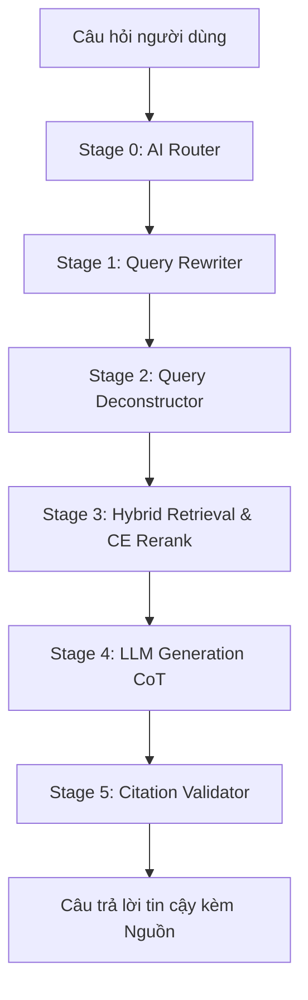

# 🚦 Trợ lý Pháp luật Giao thông Việt Nam (Hybrid RAG Pipeline & FAQ Training System)

Chào mừng bạn đến với **Trợ lý Pháp luật Giao thông Việt Nam** — hệ thống RAG (Retrieval-Augmented Generation) tiên tiến chuyên sâu về Luật Giao thông Đường bộ Việt Nam, được thiết kế để hoạt động ổn định, bảo mật và hiệu năng cao trên môi trường Production (như Streamlit Cloud).

Hệ thống tích hợp bộ dữ liệu pháp luật đã được cập nhật mới nhất (không chứa các luật cũ đã hết hiệu lực) và hỗ trợ hệ thống chuẩn bị dữ liệu huấn luyện đa nhiệm (**Multi-Task Fine-Tuning**) từ **20.000 câu FAQ** để tối ưu hóa mô hình LLM.

---

## 🏗️ Kiến trúc Hệ thống (6-Stage Pipeline)



1. **Stage 0: AI Router (Session-aware Rate Limiter)**: Đánh giá độ phức tạp câu hỏi và giới hạn tần suất cuộc gọi Cloud API (tối đa 5 cuộc gọi/phút mỗi session, tự động fallback về mô hình local).
2. **Stage 1: Query Rewriter (Tiếng lóng & Từ địa phương)**: Dịch thuật ngữ tự nhiên, tiếng lóng dã ngoại (như *xe cọp, bồ câu, thông chốt, nẹt pô, đóng bỉm*) thành từ ngữ pháp lý chuẩn hóa.
3. **Stage 2: Query Deconstructor (Phân tách chủ ý)**: Tách các câu hỏi ghép chứa nhiều lỗi vi phạm độc lập thành các câu hỏi con để thực hiện truy xuất song song.
4. **Stage 3: Hybrid Search (BM25 ⊕ ChromaDB RRF ⊕ PhoRanker)**: Tìm kiếm hỗn hợp kết hợp so khớp từ khóa và ngữ nghĩa, định vị chính xác trong kho dữ liệu pháp lý **5.485 chunks** (đã cập nhật tất cả các Luật, Nghị định và Thông tư mới nhất 2024-2026).
5. **Stage 4: LLM Generation (CoT & Context Budget Cap)**: Sử dụng kỹ thuật CoT (Chain of Thought) phân tích lập luận qua thẻ XML `<thought>`. Tích hợp bộ đệm dung lượng context (Context-Budget Cap) cắt giảm để tránh làm SLM (như Qwen 1.5B) bị quá tải.
6. **Stage 5: Citation Validator (Lớp bảo vệ hậu kỳ)**: Bộ lọc Regex và đối chiếu chéo. Phát hiện và từ chối các trích dẫn ảo giác hoặc không khớp loại phương tiện (Subject Mismatch), bảo đảm độ chính xác pháp lý tuyệt đối.

---

## 📅 Bản đồ Cập nhật Dữ liệu & Xử lý Luật Tương lai

Hệ thống đã được đồng bộ hóa và loại bỏ hoàn toàn các luật cũ hết hiệu lực, thay thế bằng các văn bản mới nhất:

| Văn bản cũ (Đã xóa) | Văn bản mới thay thế (Đã tích hợp) |
|---|---|
| **TT24/2023/TT-BCA** | **TT79/2024/TT-BCA** & **TT51/2025/TT-BCA** (Cấp, thu hồi đăng ký và biển số xe) |
| **NĐ10/2020/NĐ-CP** | **NĐ158/2024/NĐ-CP** (Hoạt động vận tải đường bộ) |
| **TT31/2019/TT-BGTVT** | **TT38/2024/TT-BGTVT** (Tốc độ và khoảng cách an toàn) |
| **TT32/2023 & TT65/2020** | **TT73/2024/TT-BCA** (Tuần tra, kiểm soát và xử lý vi phạm của CSGT) |

### ⚠️ Xử lý Luật Tương lai (NĐ94/2026/NĐ-CP)
Nghị định 94/2026/NĐ-CP có hiệu lực từ ngày **01/07/2026** (sẽ bãi bỏ NĐ 160/2024/NĐ-CP). Để tránh RAG bị nhầm lẫn khi người dùng hỏi quy định "hiện nay", hệ thống tự động gắn tiền tố cảnh báo vào mọi dòng dữ liệu của Nghị định này:
`[CHƯA CÓ HIỆU LỰC - Có hiệu lực từ 01/07/2026. Nghị định này sẽ bãi bỏ NĐ 160/2024/NĐ-CP]`

*Lưu ý: Mọi tệp CSV xuất ra đều được mã hóa bằng chuẩn `utf-8-sig` (UTF-8 có BOM) giúp hiển thị tiếng Việt chính xác và không bị lỗi font khi mở trực tiếp bằng Microsoft Excel.*

---

## 🧠 Hệ thống Huấn luyện Đa nhiệm từ 20.000 FAQ

Để huấn luyện một LLM chuyên biệt về luật giao thông đường bộ từ bộ dữ liệu FAQ cực lớn (**20.000 câu**), dự án cung cấp bộ công cụ huấn luyện trên mây tối ưu bằng **Unsloth (QLoRA)**.

### Cấu trúc Huấn luyện Đa nhiệm (Multi-Task):
Dữ liệu FAQ thô được tự động biến đổi thành **31.949 mẫu huấn luyện** thuộc 3 tác vụ:
1.  **Tác vụ QA Tự luận (100% dữ liệu)**: Trả lời chi tiết câu hỏi của người dùng kèm căn cứ pháp lý.
2.  **Tác vụ Phân loại Lỗi (30% dữ liệu)**: Trích xuất thông tin `vehicle`, `category`, `severity` dưới dạng cấu trúc JSON.
3.  **Tác vụ Ước lượng mức phạt (30% dữ liệu)**: Trích xuất chính xác khung tiền phạt `fine_min_vnd`, `fine_max_vnd` dưới dạng JSON.

### Các Script Huấn luyện (trong thư mục `scratch/`):
*   [prepare_training_data.py](file:///d:/NLP_Law%20_chatbot/scratch/prepare_training_data.py): Script làm sạch CSV 20.000 câu, lọc bỏ dòng trống, sinh prompt đa nhiệm và xuất ra file `train_faq_multitask.jsonl`.
*   [train_colab_advanced.py](file:///d:/NLP_Law%20_chatbot/scratch/train_colab_advanced.py): Script chạy fine-tune trên Google Colab GPU T4 sử dụng Unsloth QLoRA, tích hợp ghi log lên Weights & Biases (W&B).
*   [run_vast_training.sh](file:///d:/NLP_Law%20_chatbot/scratch/run_vast_training.sh): Script cài đặt môi trường tự động bằng 1 click dành cho các server GPU cao cấp (như dịch vụ thuê GPU RTX 5090).

---

## ⚡ Hướng dẫn Cài đặt & Chạy cục bộ (Local Development)

### Yêu cầu hệ thống
*   Python 3.10 hoặc 3.11
*   Ollama cài đặt cục bộ (nếu chạy mô hình SLM Offline)

### Các bước thiết lập
1.  **Clone ứng dụng và khởi tạo môi trường ảo:**
    ```bash
    git clone https://github.com/giaminhh041223/Traffic-law-assistant.git
    cd Traffic-law-assistant
    python -m venv .venv
    ```

2.  **Kích hoạt môi trường ảo:**
    *   **Windows (PowerShell):** `.venv\Scripts\Activate.ps1`
    *   **Linux/macOS:** `source .venv/bin/activate`

3.  **Cài đặt các gói phụ thuộc:**
    ```bash
    pip install -r requirements.txt
    ```

4.  **Tải mô hình SLM Offline qua Ollama:**
    ```bash
    ollama pull qwen2.5:1.5b
    ```

5.  **Chạy ứng dụng Streamlit App:**
    ```bash
    streamlit run app/streamlit_app.py
    ```

---

## 🚀 Hướng dẫn Deploy lên Streamlit Cloud

1.  Kết nối tài khoản Streamlit Cloud của bạn với repository này.
2.  Thiết lập Main file path là: `app/streamlit_app.py`.
3.  **Nạp cấu hình khóa bảo mật (Secrets TOML)** tại trang quản trị Streamlit App:
    ```toml
    # API key của Gemini
    GEMINI_API_KEY = "AIzaSyYourGeminiKeyHere..."
    
    # API key của OpenAI (Dành cho AI Router Cloud API)
    OPENAI_API_KEY = "sk-proj-YourOpenAIKeyHere..."
    
    # Chỉ định LLM Backend mặc định
    LLM_BACKEND = "openai"
    ```

---

## 🛡️ Bản quyền & Bảo mật

*   **Cô lập phiên làm việc (Session Isolation)**: Lịch sử chat được ghi độc lập tại `data/chat_history/` theo từng session UUID riêng biệt, đảm bảo không bị lộ thông tin hội thoại chéo.
*   **Bảo vệ dữ liệu**: Toàn bộ dữ liệu thô cồng kềnh (>10MB), file Nhật ký hệ thống (`logs/`), Môi trường ảo (`.venv/`), tệp cấu hình chứa mã khóa cá nhân (`.streamlit/secrets.toml`) đã được bỏ qua và bảo vệ nghiêm ngặt bằng `.gitignore`.
