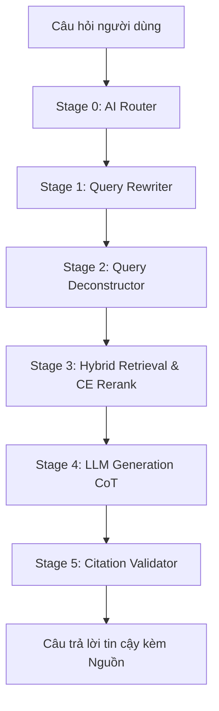

# 🚦 Trợ lý Pháp luật Giao thông Việt Nam (Hybrid RAG Pipeline)

Chào mừng bạn đến với **Trợ lý Pháp luật Giao thông Việt Nam** — hệ thống RAG (Retrieval-Augmented Generation) tiên tiến chuyên sâu về Luật Giao thông Đường bộ Việt Nam, được thiết kế để hoạt động ổn định, bảo mật và hiệu năng cao trên môi trường Production (như Streamlit Cloud).

Hệ thống được xây dựng trên nền tảng **Pipeline RAG 6 giai đoạn** mạnh mẽ giúp giải quyết các thách thức về tiếng lóng giao thông, câu hỏi đa hành vi phức tạp, và triệt tiêu hoàn toàn hiện tượng ảo giác trích dẫn pháp lý.

---

## 🏗️ Kiến trúc Hệ thống (6-Stage Pipeline)



1. **Stage 0: AI Router (Session-aware Rate Limiter)**: Đánh giá độ phức tạp câu hỏi. Đồng thời tích hợp Rate Limiter thông minh bảo vệ quota (tối đa 5 cuộc gọi Cloud API/phút mỗi session, tự động fallback về mô hình local miễn phí).
2. **Stage 1: Query Rewriter (Tiếng lóng & Từ địa phương)**: Dịch thuật ngữ tự nhiên, tiếng lóng dã ngoại (như *xe cọp, bồ câu, thông chốt, nẹt pô, đóng bỉm*) thành từ ngữ pháp lý chuẩn hóa.
3. **Stage 2: Query Deconstructor (Phân tách chủ ý)**: Tách các câu hỏi ghép chứa nhiều lỗi vi phạm độc lập thành các câu hỏi con, thực hiện truy xuất song song giúp triệt tiêu điểm nghẽn "loãng attention".
4. **Stage 3: Hybrid Search (BM25 ⊕ ChromaDB RRF ⊕ PhoRanker)**: Tìm kiếm hỗn hợp kết hợp so khớp từ khóa và ngữ nghĩa, định vị chính xác trong kho dữ liệu pháp lý **2,065 chunks** (gồm Nghị định 100/123/NĐ-CP, Luật TTATGT 2024, và QCVN 41:2019/BGTVT).
5. **Stage 4: LLM Generation (CoT & Context Budget Cap)**: Sử dụng kỹ thuật CoT (Chain of Thought) phân tích lập luận qua thẻ XML `<thought>`. Tích hợp bộ đệm dung lượng context (Context-Budget Cap) cắt giảm từ 8 xuống 5 chunks chất lượng nhất để tránh làm SLM (như Qwen 1.5B) bị quá tải.
6. **Stage 5: Citation Validator (Lớp bảo vệ hậu kỳ)**: Bộ lọc Regex và sets đối chiếu chéo. Phát hiện và từ chối các trích dẫn ảo giác hoặc không khớp loại phương tiện (Subject Mismatch), bảo đảm độ chính xác pháp lý tuyệt đối.

---

## ⚡ Hướng dẫn Cài đặt & Chạy cục bộ (Local Development)

### Yêu cầu hệ thống
*   Python 3.10 hoặc 3.11
*   Ollama cài đặt cục bộ (nếu chạy mô hình SLM Offline)

### Các bước thiết lập
1.  **Clone ứng dụng và khởi tạo môi trường ảo:**
    ```bash
    git clone https://github.com/giaminhh041223/Traffic-law-assistant.git
    cd Traffic-law-assistant
    python -m venv .venv
    ```

2.  **Kích hoạt môi trường ảo:**
    *   **Windows (PowerShell):** `.venv\Scripts\Activate.ps1`
    *   **Linux/macOS:** `source .venv/bin/activate`

3.  **Cài đặt các gói phụ thuộc:**
    ```bash
    pip install -r requirements.txt
    ```

4.  **Tải mô hình SLM Offline qua Ollama:**
    ```bash
    ollama pull qwen2.5:1.5b
    ```

5.  **Chạy ứng dụng Streamlit App:**
    ```bash
    streamlit run app/streamlit_app.py
    ```

---

## 🧪 Hệ thống Đánh giá & QA Automation (LLMOps)

Dự án tích hợp một khung đánh giá tự động toàn diện (**Evaluation Framework**) giúp stress-test hệ thống qua 15 kịch bản pháp lý lắt léo nhất.

Để chạy bộ kiểm thử tự động và xuất báo cáo chất lượng:
```bash
python -m src.phase5_evaluation.automated_tester
```

Bộ tester sẽ quét qua ma trận test tại `data/evaluation/test_matrix.json` và chấm điểm hệ thống theo 3 chỉ số vàng:
*   **Retrieval Precision**: Độ phủ chính xác của các chunk pháp luật được lấy lên.
*   **Calculation Accuracy**: Độ chính xác toán học của các phép tính tổng mức phạt (sử dụng giải thuật Digit Lookaround bảo vệ biên tránh trùng lặp substring).
*   **Hallucination Rate**: Tỷ lệ trích dẫn ảo giác phát hiện bởi Citation Validator.

Kết quả chi tiết được lưu trữ cấu trúc tại [eval_results.json](file:///D:/NLP_Law%20_chatbot/data/evaluation/eval_results.json).

---

## 🚀 Hướng dẫn Deploy lên Streamlit Cloud

Khi bạn deploy dự án lên **Streamlit Cloud**:

1.  Hãy kết nối tài khoản Streamlit Cloud của bạn với repository này: `https://github.com/giaminhh041223/Traffic-law-assistant`.
2.  Thiết lập Main file path là: `app/streamlit_app.py`.
3.  **Nạp cấu hình khóa bảo mật (Secrets TOML)**:
    Tại trang quản trị Streamlit App, chọn **Settings** -> **Secrets**, nạp nội dung cấu hình sau để hệ thống tự động kích hoạt Cloud LLM khi gặp các câu hỏi tranh chấp pháp lý phức tạp:

    ```toml
    # Streamlit Cloud Community Secrets
    
    # API key của Gemini
    GEMINI_API_KEY = "AIzaSyYourGeminiKeyHere..."
    
    # API key của OpenAI (Dành cho AI Router Cloud API)
    OPENAI_API_KEY = "sk-proj-YourOpenAIKeyHere..."
    
    # Chỉ định LLM Backend mặc định
    LLM_BACKEND = "openai"
    ```

---

## 🛡️ Bản quyền & Bảo mật

*   Hệ thống được thiết kế hoàn toàn cô lập dữ liệu chat (**Session Isolation**). Mỗi người dùng truy cập web sẽ có một UUID riêng biệt và lịch sử được ghi độc lập tại `data/chat_history/session_{session_id}.json` theo cơ chế ghi file an toàn, loại bỏ hoàn toàn khả năng lộ thông tin hội thoại chéo.
*   Mã nguồn dự án tuân thủ nghiêm ngặt bảo mật và đã ẩn toàn bộ các API key, file nhật ký cục bộ thông qua `.gitignore` tiêu chuẩn.
